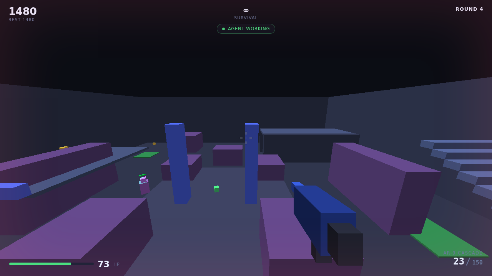
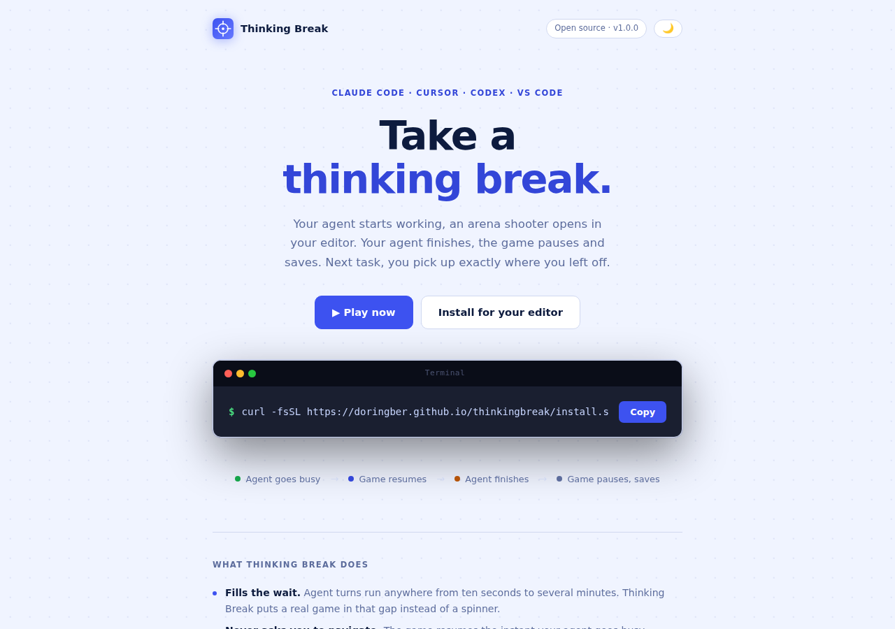

<div align="center">


# Thinking Break

**A lightweight browser arena shooter that plays while your coding agent works — and pauses the moment it stops.**

[Play now](https://thinkingbreak.netlify.app/fps/) ·
[Install](https://doringber.github.io/thinkingbreak/) ·
[Multiplayer](docs/MULTIPLAYER.md) ·
[Attribution](MIGRATION.md)

</div>

---

## Links

| | |
|---|---|
| **Play** | **https://thinkingbreak.netlify.app/fps/** |
| Landing / install page | https://doringber.github.io/thinkingbreak/ |
| Invite a teammate | `https://thinkingbreak.netlify.app/fps/?room=YOURCODE` |
| Repository | https://github.com/Doringber/thinkingbreak |
| Build status | https://github.com/Doringber/thinkingbreak/actions |

The game is published from the same commit to two independent hosts, so a
stalled deploy on one doesn't take it offline:

- **Netlify** — `thinkingbreak.netlify.app`, built straight from a push. This
  is the link to share, because it does not depend on GitHub Actions runners.
- **GitHub Pages** — `doringber.github.io/thinkingbreak/`, built by the
  workflow. The installers and the editor extensions point here.

To get a room: open the game, **Multiplayer → Create a room → Copy invite
link**, and paste that in your team chat. Whoever opens it joins the same
arena — no code to type, nothing to install.

---

## What it is

Agent turns take anywhere from ten seconds to several minutes, and staring at a
spinner is a poor use of that time. Thinking Break fills the gap with a real
game, without asking you to manage it:

1. You send a task to Claude Code, Cursor or Codex.
2. The agent goes busy.
3. Thinking Break opens or focuses — and **resumes the session you left**.
4. You play.
5. The agent finishes.
6. The game pauses instantly, saves, releases the pointer, and stops rendering.
7. You go back to the editor.
8. On the next task, the same session picks up exactly where it stopped.

No menus, no cold starts, no session resets between turns.

## Screenshots

| | |
|---|---|
|  |  |
| The arena, mid-fight | The installation page |

<sub>Screenshots are captured with `node tools/screenshots.js` against a local server.</sub>

## Quick start

```bash
git clone https://github.com/Doringber/thinkingbreak.git
cd thinkingbreak
npm install
npm run serve          # http://localhost:8080/thinkingbreak/
```

The dev server mounts the site at `/thinkingbreak/` by default, deliberately
matching the GitHub Pages base path so a broken asset path fails locally rather
than in production. Use `npm run serve -- --base /` to serve from the root.

| URL | What it is |
|---|---|
| `http://localhost:8080/thinkingbreak/` | Installation / landing page |
| `http://localhost:8080/thinkingbreak/fps/` | The game |
| `http://localhost:8080/thinkingbreak/fps/?debug=1` | The game with lifecycle test controls |
| `http://localhost:8080/thinkingbreak/fps/?embed=1` | Editor-panel mode (boots paused, waits for a host) |

## Installing for your editor

```bash
curl -fsSL https://doringber.github.io/thinkingbreak/install.sh | bash
```

Detects VS Code, Cursor and the Codex CLI; compiles and installs the matching
extension into each; and writes the agent hooks. Everything is built on your
machine — nothing is fetched from a build server.

For agents run in a plain terminal instead of an editor (macOS):

```bash
curl -fsSL https://doringber.github.io/thinkingbreak/install-terminal.sh | bash
```

Uninstall:

```bash
curl -fsSL https://doringber.github.io/thinkingbreak/uninstall.sh | bash
```

## Supported agent integrations

| Agent | Busy signal | Idle signal | Where hooks live |
|---|---|---|---|
| **Claude Code** | `PreToolUse` (`.*`), `UserPromptSubmit` | `Stop`, `SubagentStop` | `~/.claude/settings.json` |
| **Cursor** | `beforeSubmitPrompt`, `beforeShellExecution` | `stop`, `sessionEnd` | `~/.cursor/settings.json` |
| **Codex CLI** | `exec_before`, shell wrapper, `pgrep` poll | `exec_after`, wrapper exit | `~/.codex/config.toml` + shell rc |
| **VS Code / Cursor host** | — | — | Webview panel, Simple Browser fallback |

Every hook does the same tiny thing: write `{"busy":true|false}` to a JSON file
under the agent's home directory. The extension watches that file. **Your
prompts and code are never read.**

## Lifecycle behaviour

**On busy**

- Open the panel, or focus the one that already exists — never a second panel.
- Restore the saved session (mode, round, score, weapon, settings).
- Resume rendering, bots, timers and audio.
- Show an “Agent working” status pill.

**On idle / stop**

- Pause immediately and cancel the `requestAnimationFrame` loop, so a paused
  game costs essentially no CPU or GPU.
- Freeze bots and mode timers; ramp audio to silence and suspend the
  `AudioContext`.
- Save the session and release pointer lock.
- Return focus to the editor (configurable), keeping the panel alive so the
  next task resumes instantly.

**Rapid events are safe.** Agents emit a busy signal on *every* tool call:

- A repeated busy refreshes the status label and does nothing else — it never
  restarts the game.
- An idle arriving within a short grace window (default 1.2 s) is deferred, and
  a follow-up busy cancels it. You are not paused in the gap between two tool
  calls.
- Only one render loop can exist — `rafId !== null` is the single source of
  truth, checked at every entry point.
- Only one panel can exist, enforced in-process and by a lock file at
  `~/.thinking-break/panel.lock` (stale locks time out after two hours).

There is a lifecycle test harness built in: open the game with `?debug=1` and
use the **agent busy** / **agent idle** buttons.

## Game

One original arena — *Cache Line*, 48 × 48 units — built entirely from
axis-aligned boxes.

**Weapons**

| Weapon | Class | Damage | RPM | Magazine | Notes |
|---|---|---|---|---|---|
| AR-9 Cascade | Assault rifle | 21 | 660 | 30 | Automatic, tight cone, low recoil |
| SG-12 Breaker | Shotgun | 9 × 13 | 75 | 6 | Devastating up close, severe falloff |
| RG-1 Longshot | Railgun | 88 | 50 | 4 | Pinpoint, no falloff, heavy kick |

Each has its own spread, movement penalty, recoil, reload time, range and
falloff curve. Headshots deal 2.5×.

**Modes**

| Mode | Length | Rules |
|---|---|---|
| Survival | Until you die | Escalating waves; the round survives across agent turns |
| Time Attack | 90 s | Each kill adds 3 s, capped at 180 s |
| Aim Rush | 60 s | Railgun only, one shot per target, infinite ammo |
| Gun Progression | Until cleared | Three kills promotes you; clear the railgun to win |
| One Hit | Until you die | One shot kills — including you |

**Bots** move, take cover-relative positions, strafe, chase, shoot with a
difficulty-scaled reaction time and accuracy, take damage, die and respawn away
from the player. Easy / Normal / Hard change health, damage, accuracy, reaction
time, speed and score multiplier.

## Multiplayer

Optional, and off by default. Hit **Create a room** in the pause menu's
Multiplayer panel and share the link it gives you — everyone who opens it
shares one arena: you see each other move, shoot each other, and see a live
roster of who's connected and whose agent is currently busy or idle, so you
know when a teammate's arena just opened, not just your own.

```
https://thinkingbreak.netlify.app/fps/?room=YOURCODE
```

That's the whole flow: **Create a room → Copy invite link → paste in Slack.**
Nobody types a code and nobody installs anything. Two other ways in, if they
suit you better: type a code someone read out to you, or set the extension's
`roomCode` setting once — put it in workspace settings and every agent break
drops the whole team into the same arena with zero setup.

This is the one part of the project that isn't purely static — static hosting
can't hold a live connection open between players, so it talks to a small
free [Supabase](https://supabase.com/) project you provision yourself.
Nothing else needs it, single-player included, and it costs nothing to leave
unconfigured: the panel just says so. **[docs/MULTIPLAYER.md](docs/MULTIPLAYER.md)**
covers the two-minute setup, how presence/broadcast work, and the trust
model (client-authoritative, suited to a team behind a shared code — not to
strangers on the internet).

## Controls

| Input | Action |
|---|---|
| `W` `A` `S` `D` | Move |
| Mouse | Aim |
| Left click | Fire |
| `Shift` | Sprint |
| `Space` | Jump |
| `Ctrl` / `C` | Crouch — or slide, at speed |
| `R` | Reload |
| `1` `2` `3`, `Q`, mouse wheel | Switch weapon |
| `Esc` | Pause and save |
| `P` | FPS counter |

Click the arena once to capture the mouse.

## Architecture

```
thinkingbreak/
├── index.html                 Installation / landing page (Pages root)
├── site/                      Its stylesheet and script
│   ├── install.css
│   └── install.js
├── assets/favicon.svg         Product mark
├── fps/                       The game — /thinkingbreak/fps/
│   ├── index.html             HUD, overlay, canvas
│   ├── style.css
│   ├── manifest.webmanifest
│   └── src/
│       ├── main.js            Boot: wires the game to the lifecycle bridge
│       ├── core/
│       │   ├── math.js        Matrices, frustum, PRNG
│       │   ├── renderer.js    Instanced-box WebGL2 renderer
│       │   ├── input.js       Keyboard, mouse, pointer lock
│       │   ├── audio.js       Synthesised audio (no files)
│       │   └── storage.js     Versioned save + migrations
│       ├── game/
│       │   ├── game.js        Orchestrator: the single render loop
│       │   ├── arena.js       Arena geometry, spawns, pickups
│       │   ├── collision.js   Swept AABB, raycasting
│       │   ├── player.js      Movement, look, health
│       │   ├── bots.js        Bot AI
│       │   ├── weapons.js     Weapon definitions and firing rules
│       │   ├── modes.js       Game modes and scoring
│       │   └── effects.js     Pooled particles, tracers, decals
│       ├── ui/
│       │   ├── hud.js
│       │   └── menu.js
│       ├── lifecycle/
│       │   ├── agentState.js  Busy/idle state machine (pure)
│       │   └── bridge.js      postMessage / BroadcastChannel / storage / URL
│       └── multiplayer/       Opt-in — see docs/MULTIPLAYER.md
│           ├── protocol.js    Room codes, throttling, interpolation, damage (pure)
│           ├── connection.js  Supabase wrapper, dynamically imported on join
│           └── supabaseConfig.js
├── docs/MULTIPLAYER.md        Multiplayer setup, trust model, known limits
├── extensions/
│   ├── shared/                One implementation, three extensions
│   │   ├── activation.ts      Status bar, commands, watcher wiring
│   │   ├── agentWatcher.ts    State-file watcher, debounced edges
│   │   └── gamePanel.ts       Webview panel, single-panel lock
│   ├── claude/  cursor/  codex/
├── tools/
│   ├── serve.js               Dev server (base-path aware)
│   ├── build.js               Verify + parse + compile
│   ├── build-extensions.js    Sync shared sources, run tsc
│   ├── verify-paths.js        Base-path and branding guard
│   ├── verify-live.js         Real-browser check against a deployed URL
│   ├── screenshots.js         Regenerate the README screenshots
│   └── make_icon.py           Regenerate the extension icon
├── tests/                     node:test, no framework
├── install.sh  install-terminal.sh  uninstall.sh
└── .nojekyll
```

### Why no engine

Every object in the game is an axis-aligned box, so the renderer needs exactly
one 36-vertex cube plus a per-instance attribute stream, and the **entire world
draws in a single `drawArraysInstanced` call**. Collision is a slab test.
Nothing needs a scene graph, a material system, or a loader.

Three.js would have added roughly 600 KB of download for features this game
does not use. The hand-rolled WebGL2 renderer is about 8 KB, and the whole game
page is **≈190 KB uncompressed with zero dependencies** — which is what makes
it start fast enough to be worth opening for a 20-second agent turn. That's
single-player; opting into [multiplayer](docs/MULTIPLAYER.md) fetches the
Supabase SDK on top of it, but only at the moment you actually join a room —
never before, and never at all if you don't.

### Performance

- One draw call for the world, one for the viewmodel.
- Per-box frustum culling against the extracted view-projection planes.
- Fixed-size pools for particles, tracers and decals — no allocation during
  play, so no GC hitches under sustained fire.
- Delta-time integration throughout: identical handling at 60 and 240 Hz.
- Quality presets **Low / Medium / High / Auto**, changing render scale, device
  pixel-ratio cap, draw distance and particle budget. Auto samples FPS every
  three seconds and steps up or down. **Inside an editor panel the default is
  Low**, because that viewport is small and shares the machine with a compiler.
- Paused means *paused*: the rAF loop is cancelled, not skipped.

### Persistence

A single versioned key, `thinking-break/save`, holding mode, round, score,
per-mode high scores, weapon, all settings, aggregate progress and a session
timestamp. Corrupt JSON is discarded and cleared; a save from a newer build is
reset rather than misread; individual bad fields fall back to defaults so a
partially corrupted save keeps whatever was salvageable. Migrations run v1 → v2
→ v3 in sequence. If `localStorage` is unavailable, the store degrades to memory
for the rest of the page load instead of failing.

## Development

```bash
npm install
npm run serve             # dev server at /thinkingbreak/
npm run build             # verify paths, parse modules, compile extensions
npm test                  # 129 tests, node:test, no framework
npm run verify:paths      # base-path and branding guard on its own
npm run build:extensions  # just the three extensions
npm run check             # build + test
```

### Verifying a deployment for real

`deploy-pages` going green only means the files synced — not that the page
loads, the ES modules resolve under the base path, or the game boots. To check
that, `tools/verify-live.js` drives a real Chromium at a URL and asserts all of
it, including a full agent idle → pause → busy → resume cycle on the live
build:

```bash
npm i -D playwright && npx playwright install chromium
npm run verify:live                                        # production
npm run verify:live -- http://localhost:8080/thinkingbreak/ # local
```

It exits non-zero on any failure, and the Pages workflow runs it against the
freshly published URL after every deploy. Playwright is a dev-only dependency —
the game itself still ships with none.

### Building an extension `.vsix`

```bash
npm run build:extensions
cd extensions/claude
npx @vscode/vsce package --no-dependencies
code --install-extension thinking-break-1.0.0.vsix --force
```

`extensions/shared/` is the single source of truth; `build-extensions.js`
syncs it into each extension's git-ignored `src/shared/` before `tsc` runs.

### Tests

`tests/` covers everything that does not need a GPU:

| File | Covers |
|---|---|
| `weapons.test.js` | Damage, falloff, headshots, fire-rate limits, spread, recoil, reload, ammo |
| `modes.test.js` | Scoring, streaks, difficulty, mode timers, round advance, win/lose conditions |
| `persistence.test.js` | Save round-trip, v1→v4 migrations, corruption, clamping, hostile storage |
| `lifecycle.test.js` | Busy→idle, idle→busy, duplicate suppression, event storms, grace window, boot config |
| `world.test.js` | Collision, swept-AABB tunnelling, raycasts, movement, jump pads, bots, stuck recovery |
| `multiplayer.test.js` | Room codes, publish throttling, interpolation, damage math, snapshot sanitisation, roster |

## Deployment

GitHub Pages serves the repository root at
`https://doringber.github.io/thinkingbreak/`. `.github/workflows/pages.yml`
verifies paths and runs the tests, then publishes the tree as-is.

**Every path in the project is relative.** `tools/verify-paths.js` fails the
build on a root-absolute `src`/`href`/`url()`, on a reference to a file that
does not exist, on a bare ES module specifier, and on a Pages URL outside
`/thinkingbreak/`.

### First-time Pages setup

Two things have to be right, and neither can be fixed from a workflow:

1. **Settings → Pages → Source → GitHub Actions.** Until this is set,
   `actions/configure-pages` fails with *"Create Pages site failed. Resource
   not accessible by integration"*. The workflow passes `enablement: true`,
   which asks GitHub to create the site automatically — but a workflow's
   `GITHUB_TOKEN` is not permitted to create a Pages site, so the first
   enablement is always a manual step by the repository owner.

2. **Leave Custom domain empty.** A custom domain makes GitHub serve the site
   at that domain's *root* instead of `/thinkingbreak/`, and
   `doringber.github.io/thinkingbreak/` then redirects to it. The relative
   paths in the game survive that move, but every absolute
   `https://doringber.github.io/thinkingbreak/…` link — the install command,
   the extensions' default `gameUrl` — would point at the wrong host. An
   invalid domain is worse: nothing resolves at all. If you do want a custom
   domain, update `DEFAULT_GAME_URL` in `extensions/shared/activation.ts`, the
   URLs in the installer scripts, and `BASE_URL` in `tools/verify-paths.js` to
   match.

## Extending

### Add a weapon

Append an entry to `WEAPONS` in `fps/src/game/weapons.js`:

```js
{
  id: 'smg', name: 'SMG-4 Static', slot: 4,
  damage: 14, pellets: 1, rpm: 900,
  spread: 0.012, moveSpread: 0.02,
  recoil: 0.006, recoilH: 0.006,
  magazine: 40, reserve: 200, reloadMs: 1300,
  range: 80, falloffStart: 18, falloffEnd: 45, minDamageMul: 0.5,
  auto: true, color: [0.9, 0.4, 0.3], pitch: 520,
}
```

That is the whole change. The loadout, HUD, viewmodel, audio and weapon cycling
all read from the definition. Add a `Digit4` case in `Game.onInputAction` if you
want a direct-select key, and a case in `drawViewmodel` for a distinguishing
silhouette block.

### Add a game mode

Add an entry to `MODES` in `fps/src/game/modes.js`:

```js
headhunter: {
  ...base,
  id: 'headhunter', name: 'Headhunter',
  blurb: 'Only headshots count.',
  durationMs: 45_000,
  playerLives: false,
  concurrentBots: () => 4,
  onStart(rt) { rt.headsOnly = true; },
  onKill(rt) { /* mutate rt */ },
  isOver: (rt) => rt.timeLeftMs <= 0,
}
```

The mode list, persistence and the pause menu pick it up automatically.
Optional hooks: `forcedWeapon` / `weaponFor(rt)`, `infiniteAmmo`,
`oneHitKills`, `oneHitDeaths`, `respawnBots`, `outcomeFor(rt)`.

### Modify the arena

`fps/src/game/arena.js` is plain data. Push boxes with `makeBox(x, y, z, hx,
hy, hz, { color })` (centre + half-extents) or `boxFromBounds(minX, minY, minZ,
maxX, maxY, maxZ, { color })`. Ramps are staircases of shallow steps, which
keeps them axis-aligned and free in collision. Add `{ solid: false }` for
decoration. Jump pads, pickups and spawn points are separate arrays; spawn `y`
is the ground level at that point.

Two tests guard the arena: no spawn point may be buried inside geometry, and no
jump pad may overlap the player spawn.

## Known limitations

- **WebGL2 is required.** Browsers without it get an explanatory message rather
  than a blank canvas.
- **Tracers are yaw-only boxes.** A box instance cannot pitch, so non-railgun
  tracers are drawn as short streaks where the approximation is invisible. A
  full-length steeply-angled tracer would visibly miss.
- **Bots have no navmesh.** Steering plus a stuck detector is enough for one
  compact arena with open lanes; it would not scale to a maze.
- **Pointer lock and the browser.** In a normal browser tab, losing pointer lock
  pauses the game. Inside an editor panel it does not, because panel focus
  changes are routine.
- **The terminal installer is macOS-only** — it uses `osascript` and `launchd`.
  Linux and Windows users should use the editor extensions.
- **Simple Browser mode cannot pause in place.** It has no message channel, so
  `useSimpleBrowser: true` falls back to reload-based resume. The default
  webview panel does not have this limitation.
- **Codex hook support varies by version.** Hence three detection layers.
- **One arena, no cross-room leaderboard.** By design — it is a break, not a
  second job.
- **Multiplayer has no server-authoritative hit detection**, does not network
  crouch height, and treats a PvP kill like a bot kill for mode/score
  progression. See [docs/MULTIPLAYER.md](docs/MULTIPLAYER.md#known-limitations)
  for the full list and why the trust model is what it is.

## Migration and attribution

Thinking Break's agent-lifecycle integration is adapted from the author's own
[`Doringber/creativity`](https://github.com/Doringber/creativity) project
("Pango Snack"), which credits
[`ofershap/context-snack`](https://github.com/ofershap/context-snack) for the
original idea. The game itself — arena, weapons, bots, modes, renderer, audio,
persistence — is entirely new and original to this repository.

**[MIGRATION.md](MIGRATION.md)** documents component by component what was
copied, what was adapted and how, and what was written from scratch.

Thinking Break is not affiliated with, endorsed by, or an official product of
Anthropic, OpenAI, Cursor, Microsoft, or any game company.

## Licence

[MIT](LICENSE).
